<style>
.reveal h1, .reveal h2, .reveal h3 {
  word-wrap: normal;
  -moz-hyphens: none;
}
.small-code pre code {
  font-size: 1em;
}
.midcenter {
    position: fixed;
    top: 50%;
    left: 50%;
}
.footer {
    color: black; background: #E8E8E8;
    position: fixed; top: 90%;
    text-align:center; width:100%;
}
.pinky .reveal .state-background {
  background: #FF69B4;
} 
.pinky .reveal h1,
.pinky .reveal h2,
.pinky .reveal p {
  color: black;
}

</style>
Introduction to dplyr
========================================================
author: 
date: 
autosize: true

Review - Reading files
========================================================

Picking the file manually with `file.choose`


```r
surveys <- read.csv( file.choose() )
```

Review - Reading files
========================================================

Using a path (in a string).


```r
surveys <- 
  read.csv('portal_data_joined.csv')
```

What is `dpylr` and `tidyverse`?
========================================================

- Package for managing and manipulating data
- Consists of
  - `dpylr`
    - filter
    - make new columns
    - aggregate
  - `tildr`
    - Fix data and apply golden rule
  - `ggplot`
    - Nice graphics
    
    
Installing `tidyverse`
========================================================


```r
# Only need to do this once
# Time consuming!
install.packages("tidyverse")
```

Loading a Library
========================================================


```r
# This loads all of the dpylr functions
library("dplyr")
```

Selecting columns with `select`
========================================================


```r
# Syntax: select(df, col1, col2, ...)
new_df <- select(surveys, plot_id, species_id, weight)

# Good habit: Always inspect the result with head
head(new_df)
```

```
  plot_id species_id weight
1       2         NL     NA
2       2         NL     NA
3       2         NL     NA
4       2         NL     NA
5       2         NL     NA
6       2         NL     NA
```

Selecting rows with `filter`
========================================================


```r
new_df2 <- filter(surveys, year == 1995)
head(new_df2)
```

```
  record_id month day year plot_id species_id sex hindfoot_length weight
1     22314     6   7 1995       2         NL   M              34     NA
2     22728     9  23 1995       2         NL   F              32    165
3     22899    10  28 1995       2         NL   F              32    171
4     23032    12   2 1995       2         NL   F              33     NA
5     22003     1  11 1995       2         DM   M              37     41
6     22042     2   4 1995       2         DM   F              36     45
      genus  species   taxa plot_type
1   Neotoma albigula Rodent   Control
2   Neotoma albigula Rodent   Control
3   Neotoma albigula Rodent   Control
4   Neotoma albigula Rodent   Control
5 Dipodomys merriami Rodent   Control
6 Dipodomys merriami Rodent   Control
```

```r
# Why are there columns not select (last slide) still here?
```

Making a new column with `mutate`
========================================================


```r
new_df <- select(surveys, plot_id, species_id, weight, year)
new_df2 <- filter(new_df, year == 1995)
new_df3 <- mutate(new_df2, weight_kg = weight / 1000)
head(new_df3)
```

```
  plot_id species_id weight year weight_kg
1       2         NL     NA 1995        NA
2       2         NL    165 1995     0.165
3       2         NL    171 1995     0.171
4       2         NL     NA 1995        NA
5       2         DM     41 1995     0.041
6       2         DM     45 1995     0.045
```

Fundamental `dyplr`/functional principles
========================================================

- data frame in, data frame out
- returns a **new** data frame
  - no mutation

Imperative pattern - Save, save, save
========================================================

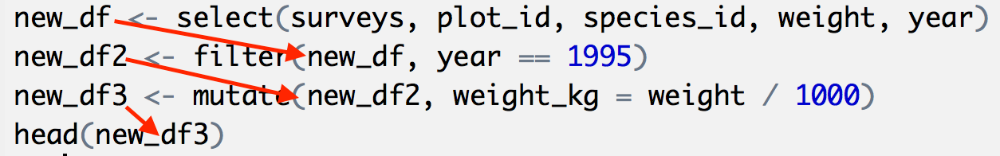
- **Problem 1:** Lots of temporary variables
- **Problem 2:** Messy and lots of *overhead*
  - All the extra *stuff* clouds the meaning/intent of the code

Poor solution - Rewrite to the same data frame
========================================================


```r
# What is wrong with this approach?
surveys <- select(surveys, plot_id, species_id, weight, year)
surveys <- filter(surveys, year == 1995)
surveys <- mutate(surveys, weight_kg = weight / 1000)
head(surveys)
```

Use a pipe for cleaner code
========================================================


```r
surveys  %>% 
  select(         plot_id, species_id, weight, year) %>%
  filter(         year == 1995) %>%
  mutate(         weight_kg = weight / 1000) %>%
  head(           )
```

```
  plot_id species_id weight year weight_kg
1       2         NL     NA 1995        NA
2       2         NL    165 1995     0.165
3       2         NL    171 1995     0.171
4       2         NL     NA 1995        NA
5       2         DM     41 1995     0.041
6       2         DM     45 1995     0.045
```

Pipe pushes the data frame through the first position
========================================================

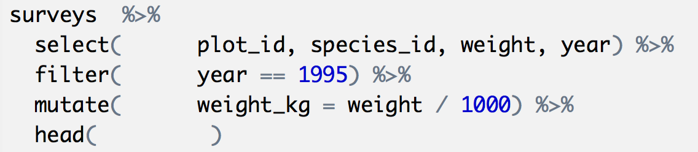

Imagine an invisible data frame in the first spot
========================================================


```r
surveys  %>% 
  select(#surveys,      
                      plot_id, species_id, weight, year) %>%
  filter(#df_sel,
                      year == 1995) %>%
  mutate(#df_sel_filt,     
                      weight_kg = weight / 1000) %>%
  head(#df_sel_filt_mutate        
       )
```

```
  plot_id species_id weight year weight_kg
1       2         NL     NA 1995        NA
2       2         NL    165 1995     0.165
3       2         NL    171 1995     0.171
4       2         NL     NA 1995        NA
5       2         DM     41 1995     0.041
6       2         DM     45 1995     0.045
```

Important Point - Each data frame is NEW
========================================================

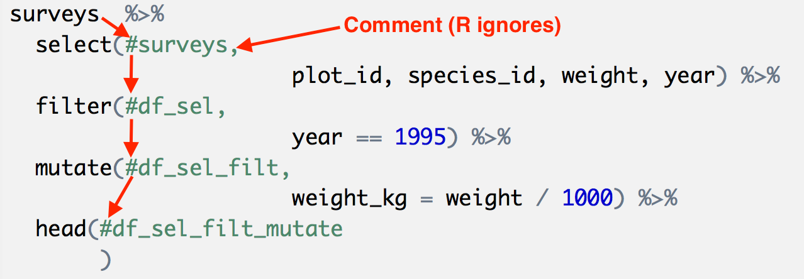


Imagine the missing data frame ... but don't write it!
========================================================


```r
surveys  %>% 
  select(plot_id, species_id, weight, year) %>%
  filter(year == 1995) %>%
  mutate(weight_kg = weight / 1000) %>%
  head()
```

```
  plot_id species_id weight year weight_kg
1       2         NL     NA 1995        NA
2       2         NL    165 1995     0.165
3       2         NL    171 1995     0.171
4       2         NL     NA 1995        NA
5       2         DM     41 1995     0.041
6       2         DM     45 1995     0.045
```

Saving the result of a piped operation
========================================================


```r
surveys_small <- surveys %>%
  filter(weight < 5) %>%
  select(species_id, sex, weight)

head(surveys_small)
```

```
  species_id sex weight
1         PF   F      4
2         PF   F      4
3         PF   M      4
4         RM   F      4
5         RM   M      4
6         PF          4
```

Challenge
========================================================

Create a new data frame from the surveys data that meets the following criteria: 

- contains only the **`species_id`** column and 
- a new column called  **`hindfoot_half`** 
  - values that are half the **`hindfoot_length`** values. 
- **`hindfoot_half`** column has 
  - no `NA`s and 
  - all values are less than 30.

Hint: think about how the commands should be ordered to produce this data frame!

Review - piping
========================================================

* Push output to next function
* First position

***


```r
library(dplyr)
pi %>%
  round(2) %>%
  as.character
```

```
[1] "3.14"
```

The advantages of piping
========================================================

* reads left-to-right
* reads top-to-bottom
* Focus on verbs
* Removes pointless nouns

***


```r
pi %>%
  round(2) %>%
  as.character
```

```
[1] "3.14"
```

Convert - Imperative
========================================================


```r
x <- pi
r_x <- 
  round(x, 2)
c_x <- 
  as.character(r_x)
```

***


```r
pi %>%
  round(2) %>%
  as.character
```

```
[1] "3.14"
```


Convert - Functions
========================================================


```r
as.character(
  round(
    pi, 2))
```

```
[1] "3.14"
```

***


```r
pi %>%
  round(2) %>%
  as.character
```

```
[1] "3.14"
```

Challenge - Convert to imperative
========================================================


```r
surveys %>%
  filter(weight < 5) %>%
  select(species_id, sex, weight)
```

```
   species_id sex weight
1          PF   F      4
2          PF   F      4
3          PF   M      4
4          RM   F      4
5          RM   M      4
6          PF          4
7          PP   M      4
8          RM   M      4
9          RM   M      4
10         RM   M      4
11         PF   M      4
12         PF   F      4
13         RM   M      4
14         RM   M      4
15         RM   F      4
16         RM   M      4
17         RM   M      4
```

Challenge - Convert to functional
========================================================


```r
surveys %>%
  filter(weight < 5) %>%
  select(species_id, sex, weight)
```

```
   species_id sex weight
1          PF   F      4
2          PF   F      4
3          PF   M      4
4          RM   F      4
5          RM   M      4
6          PF          4
7          PP   M      4
8          RM   M      4
9          RM   M      4
10         RM   M      4
11         PF   M      4
12         PF   F      4
13         RM   M      4
14         RM   M      4
15         RM   F      4
16         RM   M      4
17         RM   M      4
```

Types of programming errors
========================================================

* Name errors
* Syntax errors
* Semantic errors (hardest/worst)

Name Errors - Using the wrong name
========================================================


```r
# Find the name errors
sales %>%
  select(salesperson, sedan)
```

Syntax errors - Incorrect syntax
========================================================


```r
# Find the syntax errors
sales %>%
  group_by(Salesperson) %>%
  mutate(avg_sedan = mean(Sedan),
         avg_SUV = mean(SUV)
         avg_truck = mean(Truck)
```

Semantic Errors - Correct code, wrong meaning
========================================================


```r
# Find the semantic errors
sales %>%
  group_by(Salesperson) %>%
  mutate(avg_sedan = median(Truck))
```

Comparing JMP to dlpyr
========================================================

JMP

* Visual
* Point-and-click
* No name or syntax errors
  * Still have semantic errors
  
***

dplyr

* automated
* reproducible
* easy to make changes

Translating dplyr to JMP
========================================================

* Same actions, different syntax
* Use what you already know
  * Figure out process in JMP
  * Translate to `dplyr`


Simple Aggregations
========================================================


```r
surveys %>%
  summarise(
    avg_wgt = mean(weight, 
                   na.rm = TRUE))
```

```
   avg_wgt
1 42.67243
```

Simple Aggregations
========================================================

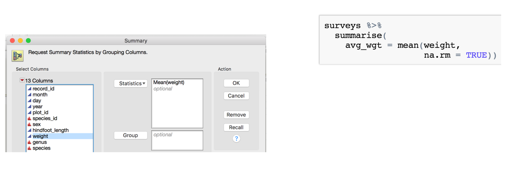

Simple Aggregations
========================================================

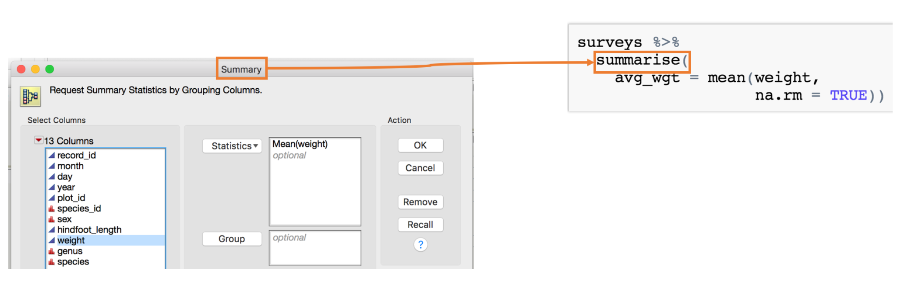

Simple Aggregations
========================================================

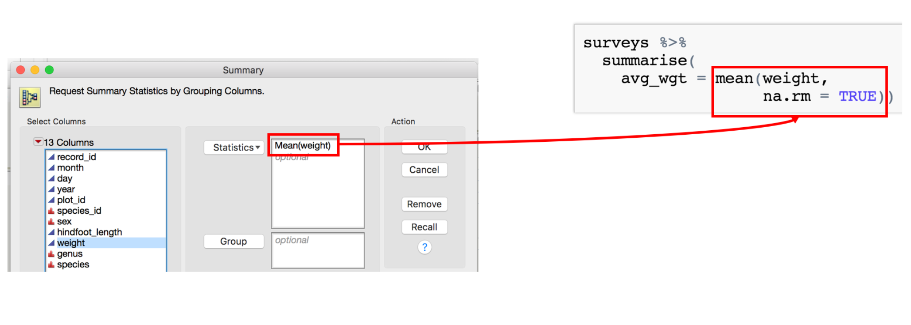

Group and Aggregate
========================================================


```r
grp_agg <- 
  surveys %>%
  group_by(taxa) %>%
  summarise(
    avg = mean(weight, 
               na.rm = TRUE))
```

Group and Aggregate
========================================================


```r
grp_agg 
```

```
# A tibble: 4 x 2
     taxa      avg
   <fctr>    <dbl>
1    Bird      NaN
2  Rabbit      NaN
3 Reptile      NaN
4  Rodent 42.67243
```

Group and Aggregate
========================================================

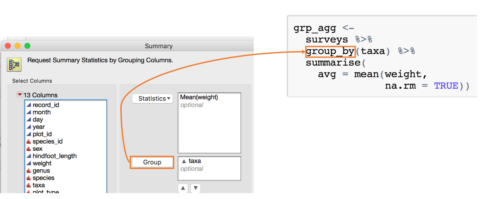

Group and Aggregate
========================================================

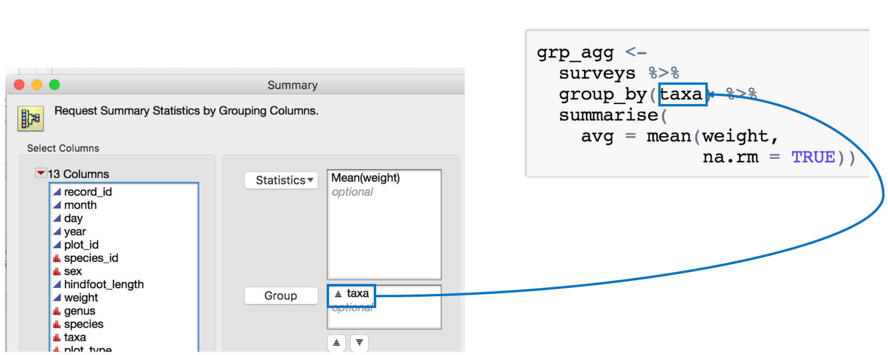

Group and Aggregate
========================================================

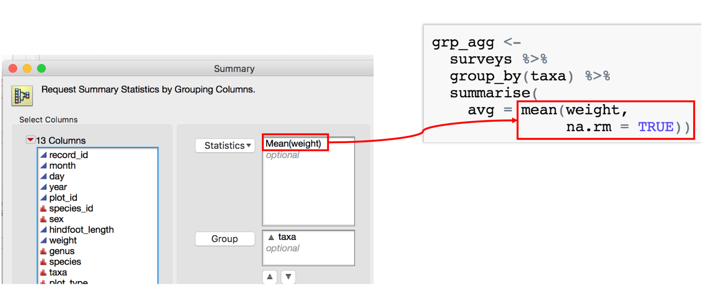

Removing NAs
========================================================


```r
grp_agg <- 
  surveys %>%
  filter(!is.na(weight)) %>%
  group_by(taxa) %>%
  summarise(
    avg = mean(weight))
```

Group and Aggregate
========================================================


```r
grp_agg 
```

```
# A tibble: 1 x 2
    taxa      avg
  <fctr>    <dbl>
1 Rodent 42.67243
```


Multiple Group Variables
========================================================


```r
grp_agg_2 <- 
  surveys %>%
  group_by(taxa, sex) %>%
  summarise(
    cnt = n())
```

Group and Aggregate
========================================================


```r
grp_agg_2 
```

```
# A tibble: 6 x 3
# Groups:   taxa [?]
     taxa    sex   cnt
   <fctr> <fctr> <int>
1    Bird          450
2  Rabbit           75
3 Reptile           14
4  Rodent         1209
5  Rodent      F 15690
6  Rodent      M 17348
```

Challenge - What is a tibble?
========================================================


```r
# Explore the output
surveys %>%
  group_by(taxa)
```

A familiar example - auto sales
========================================================


```r
sales <-
  read.csv("auto_sales.csv")
```

A familiar example - auto sales
========================================================


```r
sales 
```

```
  Salesperson Compact Sedan SUV Truck
1         Ann      22    18  15    12
2         Bob      19    12  17    20
3     Yolanda      19     8  32    15
4      Xerxes      12    23  18     9
```

Stacking and Unstacking Columns
========================================================

* `library(tidyr)`
* Stack $\rightarrow$ `gather`
* Unstack $\rightarrow$ `spread` 

Review - Numeric column transformation
========================================================


```r
sales %>%
  mutate(car_sales = Compact + Sedan)
```

```
  Salesperson Compact Sedan SUV Truck car_sales
1         Ann      22    18  15    12        40
2         Bob      19    12  17    20        31
3     Yolanda      19     8  32    15        27
4      Xerxes      12    23  18     9        35
```

Translating JMP to dplyr - Numeric transformations
========================================================

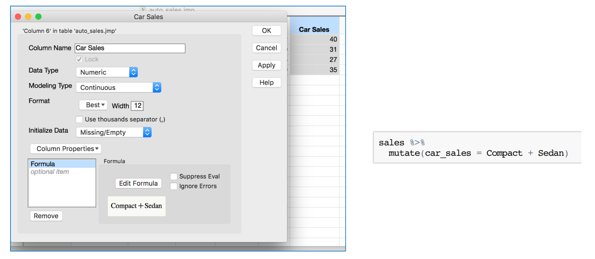

Translating JMP to dplyr - Numeric transformations
========================================================

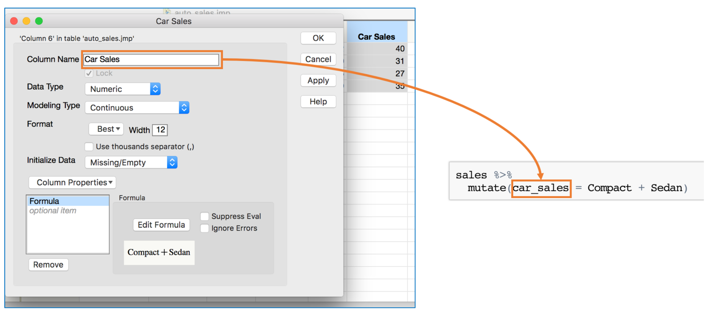


Translating JMP to dplyr - Numeric transformations
========================================================

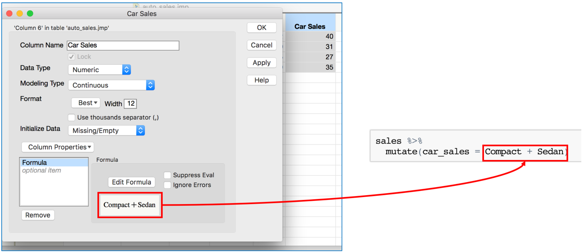

Translating JMP to dplyr - Column select
========================================================


```r
sales %>%
  select(Salesperson,
         Compact,
         Sedan)
```

```
  Salesperson Compact Sedan
1         Ann      22    18
2         Bob      19    12
3     Yolanda      19     8
4      Xerxes      12    23
```

Translating JMP to dplyr - Column select
========================================================

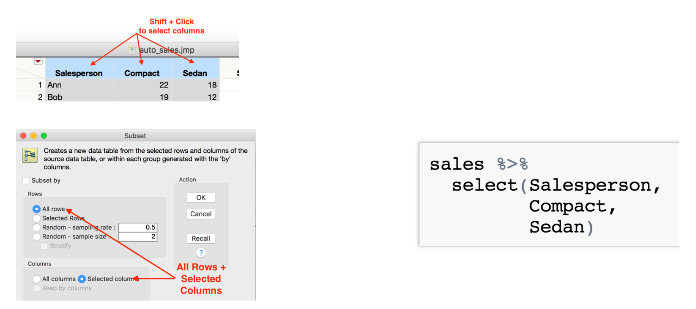

Translating JMP to dplyr - Column select
========================================================

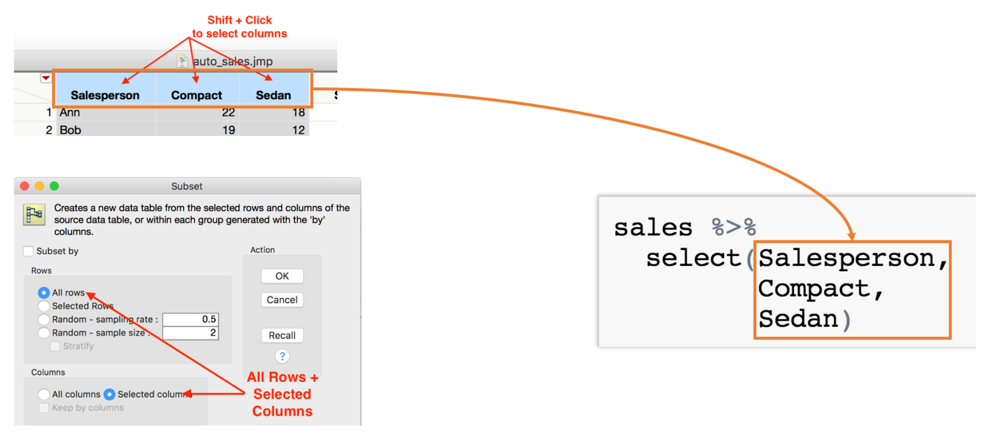

Translating JMP to dplyr - Column select
========================================================

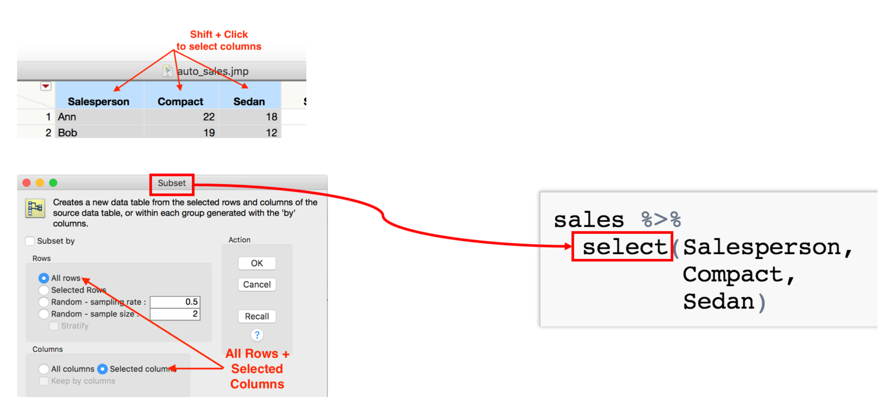


Stacking Columns with gather
========================================================

Arguments are:

1. label column name 
2. data column name
3. then a list of columns to stack

Example - Stacking auto sales
========================================================


```r
library(tidyr)
stacked_sales <-
  sales %>%
  gather("auto_type",
         "num_sales", 
         Compact, 
         Sedan,
         SUV, 
         Truck)
```

Example - Stacking auto sales
========================================================


```r
head(stacked_sales)
```

```
  Salesperson auto_type num_sales
1         Ann   Compact        22
2         Bob   Compact        19
3     Yolanda   Compact        19
4      Xerxes   Compact        12
5         Ann     Sedan        18
6         Bob     Sedan        12
```
  
Translating gather
========================================================

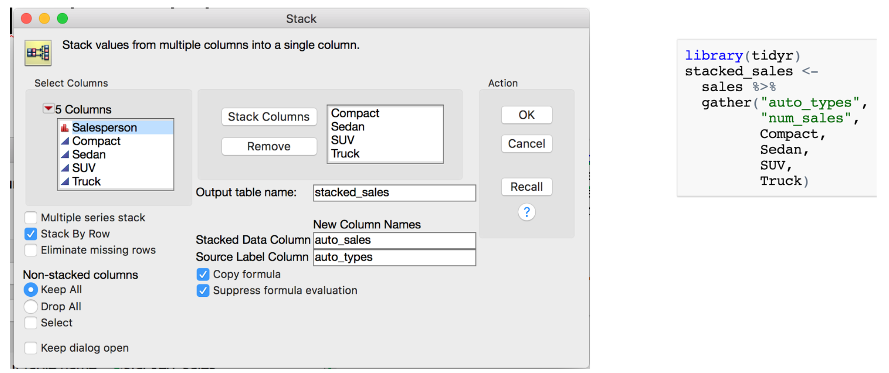

Translating gather
========================================================

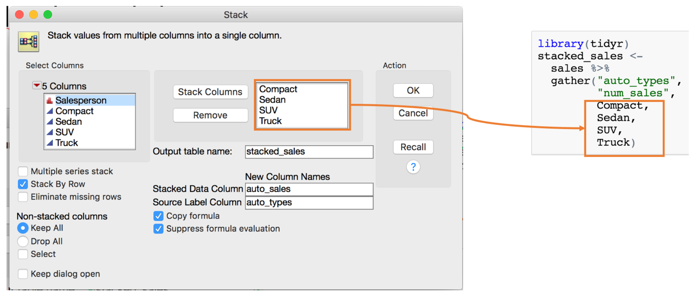

Translating gather
========================================================

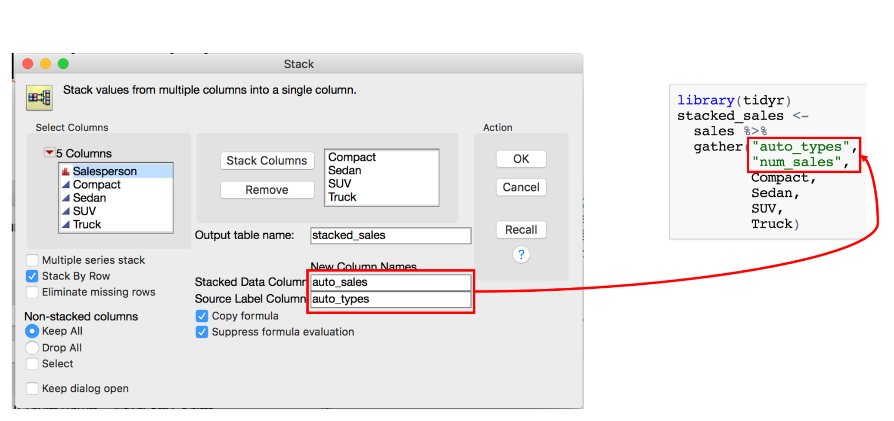

Translating gather
========================================================

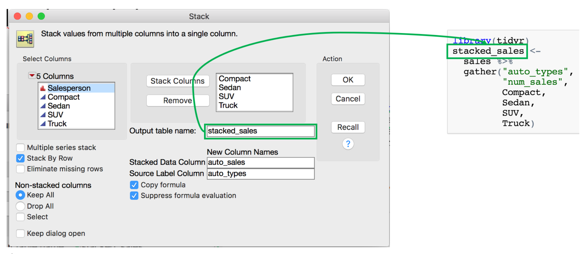

Using -Salesperson trick
========================================================


```r
library(tidyr)
stacked_sales <-
  sales %>%
  gather("auto_type",
         "num_sales", 
         -Salesperson) #Everything but
```

Example - Stacking auto sales
========================================================


```r
head(stacked_sales)
```

```
  Salesperson auto_type num_sales
1         Ann   Compact        22
2         Bob   Compact        19
3     Yolanda   Compact        19
4      Xerxes   Compact        12
5         Ann     Sedan        18
6         Bob     Sedan        12
```

Translating JMP to dplyr - Row filter
========================================================


```r
stacked_sales %>%
  filter(num_sales > 20)
```

```
  Salesperson auto_type num_sales
1         Ann   Compact        22
2      Xerxes     Sedan        23
3     Yolanda       SUV        32
```

Translating JMP to dplyr - Row filter
========================================================

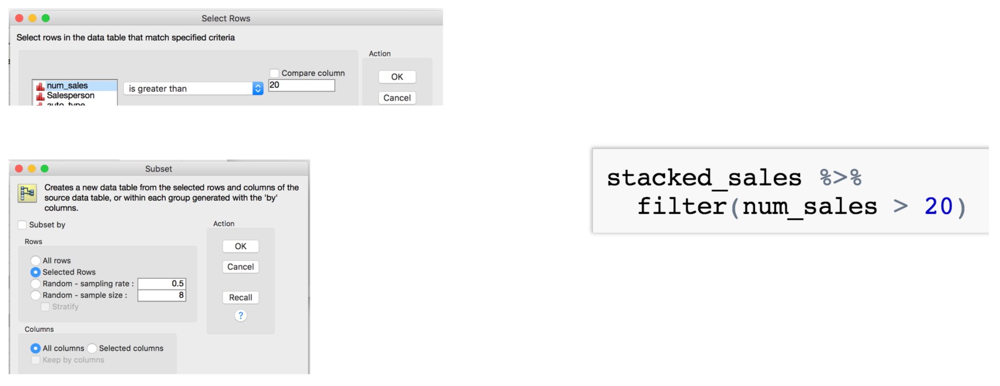

Translating JMP to dplyr - Row filter
========================================================

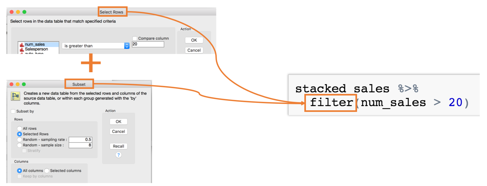

Translating JMP to dplyr - Row filter
========================================================

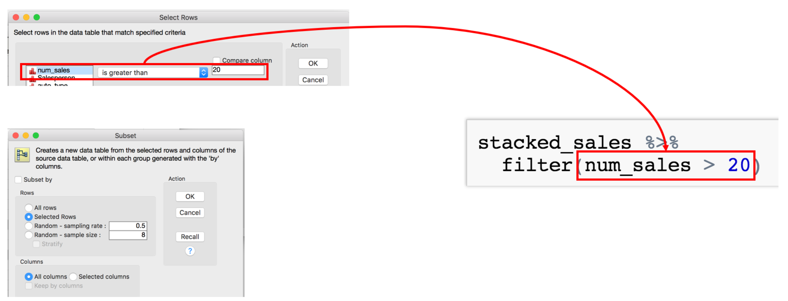

Character transformations with recode
========================================================


```r
stacked_sales <-
  stacked_sales %>%
  mutate(car_type = 
           recode(auto_type, 
                  Compact = "Car",
                  Sedan = "Car",
                  SUV = "Utility",
                  Truck = "Utility"))
```

Translating JMP to dplyr - Character transformation
========================================================

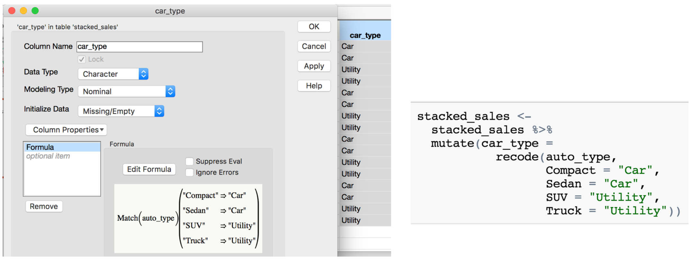

Translating JMP to dplyr - Character transformation
========================================================

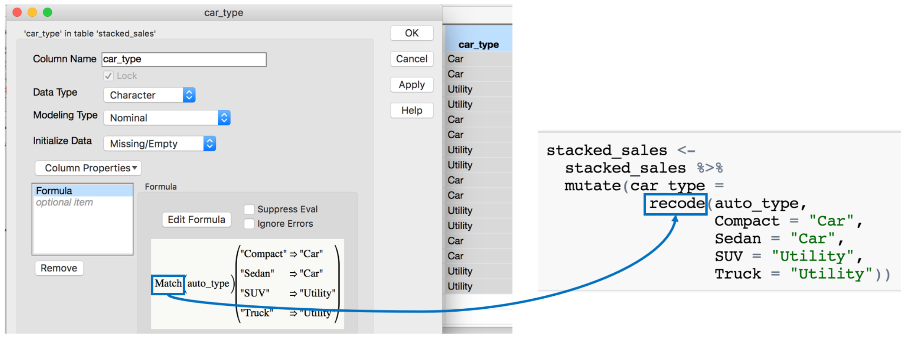

Translating JMP to dplyr - Character transformation
========================================================

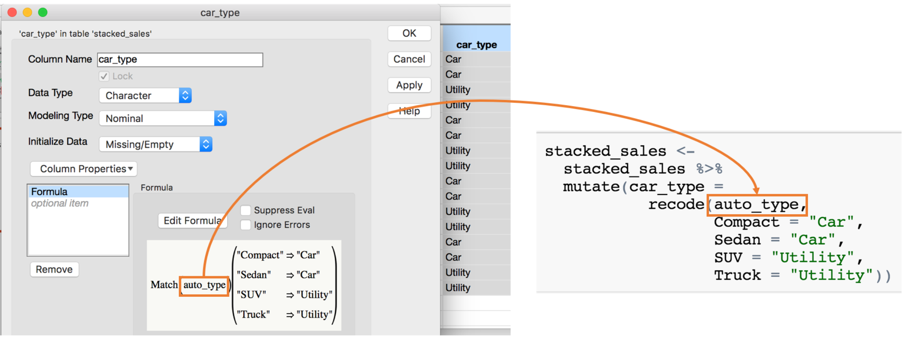

Translating JMP to dplyr - Character transformation
========================================================

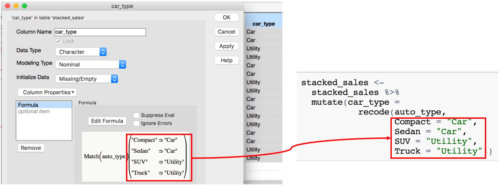

Translating JMP to dplyr - Character transformation
========================================================

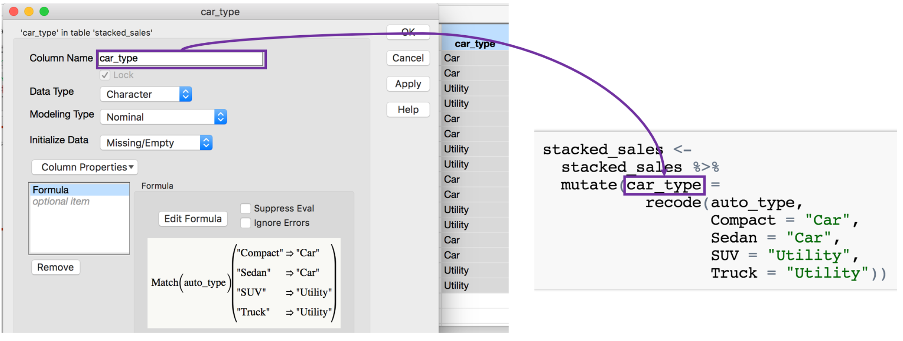

Example - Grouping and aggregate the sales by car_type
========================================================


```r
car_sales <- 
  stacked_sales %>%
  group_by(Salesperson, car_type) %>%
  summarise(car_sales = sum(num_sales)) %>%
  as.data.frame
```

Example - Grouping and aggregate the sales by car_type
========================================================


```r
car_sales
```

```
  Salesperson car_type car_sales
1         Ann      Car        40
2         Ann  Utility        27
3         Bob      Car        31
4         Bob  Utility        37
5      Xerxes      Car        35
6      Xerxes  Utility        27
7     Yolanda      Car        27
8     Yolanda  Utility        47
```

Unstacking columns with spread
========================================================

Arguments are:

1. Column to split on
2. Column to split

Example - Unstacking car sales
========================================================


```r
car_sales_unstacked <-
  car_sales %>%
  spread(car_type, car_sales) %>%
  as.data.frame
```

Example - Unstacking car sales
========================================================


```r
car_sales_unstacked
```

```
  Salesperson Car Utility
1         Ann  40      27
2         Bob  31      37
3      Xerxes  35      27
4     Yolanda  27      47
```

Translating JMP to dplyr - Unstacking
========================================================

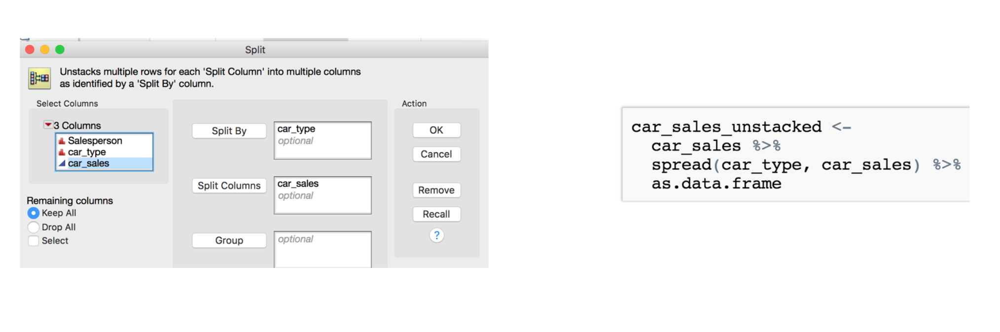

Translating JMP to dplyr - Unstacking
========================================================

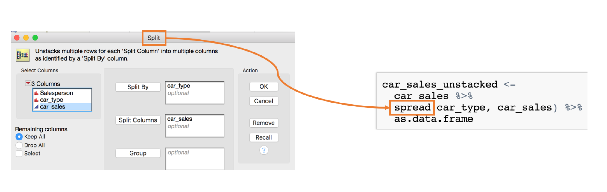

Translating JMP to dplyr - Unstacking
========================================================

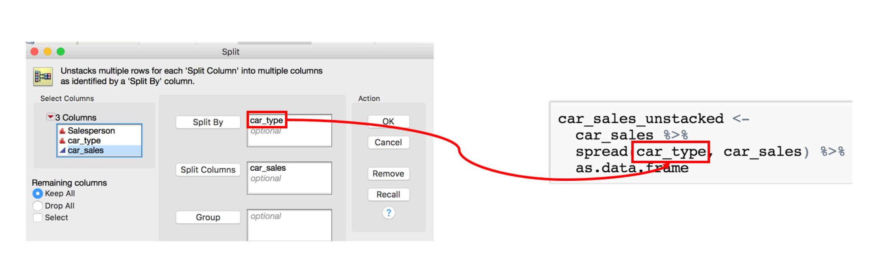

Translating JMP to dplyr - Unstacking
========================================================

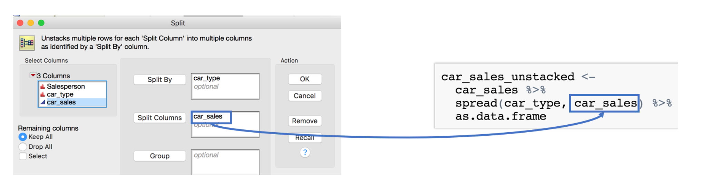
